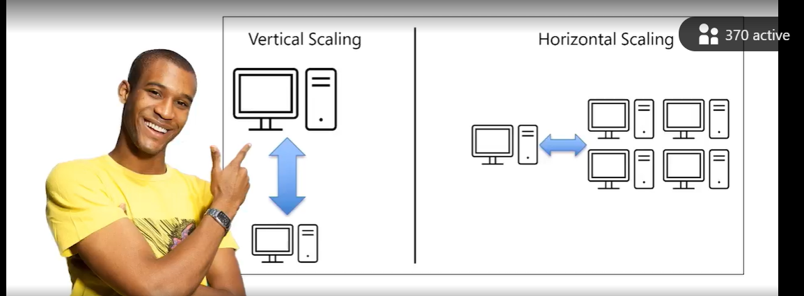
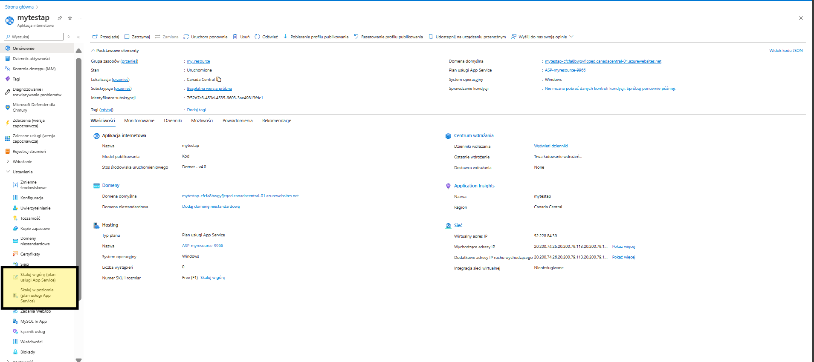
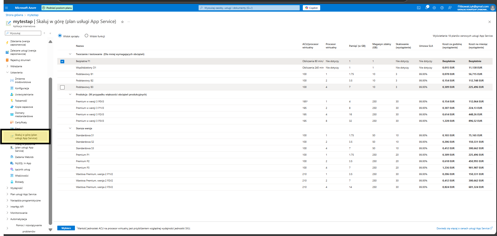
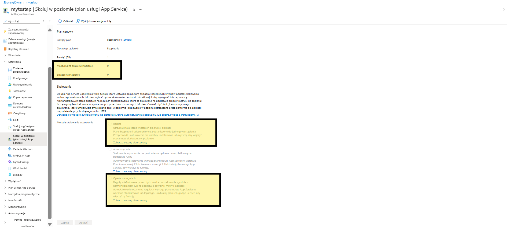

# AZ_App_Scaling
 How to app scaling

 If you need scaling you app you can do this in two way.

 First that is vertical that is upgrade or downgrade your vm.

 Second that is horisontal typical loud balancing mode.

 

 If you need scal your app for upgrade you most take first option if you need to do loud balance take the second option.

 

 Like you see you on this place you can scaling your domain in vertical (upgrade or downgrade your) app domain.

 

 On that area you can scaling your domain in horizontal 

 - you can do this manualy or automaticly (you can create manualy second vm for loud balancing or you can create some roulce when this second vm most be running)

 

 
